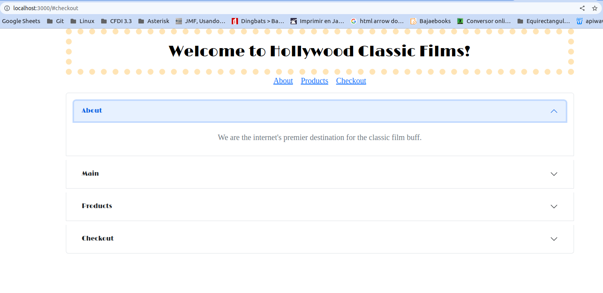
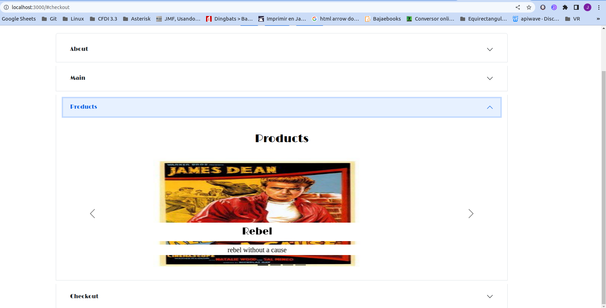

<div align="center" id="top"> 
  
  

  &#xa0;

  <!-- <a href="https://mitmern2022.netlify.app">Demo</a> -->
</div>

<h1 align="center">Single Page App Demo</h1>

<p align="center">
  

  

  

  

  <!--  -->

  <!--  -->

  <!--  -->
</p>

<!-- Status -->

<!-- <h4 align="center"> 
	🚧  MIT MERN 2022 🚀 Under construction...  🚧
</h4> 

<hr> -->

<p align="center">
  <a href="#dart-about">About</a> &#xa0; | &#xa0; 
  <a href="#sparkles-features">Features</a> &#xa0; | &#xa0;
  <a href="#rocket-technologies">Technologies</a> &#xa0; | &#xa0;
  <a href="#white_check_mark-requirements">Requirements</a> &#xa0; | &#xa0;
  <a href="#checkered_flag-starting">Starting</a> &#xa0; | &#xa0;
  <a href="#memo-license">License</a> &#xa0; | &#xa0;
  <a href="https://github.com/jlpm-mex" target="_blank">Author</a>
</p>

<br>

## :dart: About ##

Se tomo el proyecto de single page application de la semana 17 del curso, y se modifico separando en componente de react las diferentes secciones de la pagina, y se hicieron algunas mejoras a los estilos

## :sparkles: Features ##

:heavy_check_mark: Acordeón;\
:heavy_check_mark: Carrusel;\
:heavy_check_mark: Tablas;

## :rocket: Technologies ##

The following tools were used in this project:

- [Node.js](https://nodejs.org/en/)
- [React](https://pt-br.reactjs.org/)
- [JavaScript](https://developer.mozilla.org/en-US/docs/Web/JavaScript)
- [React-Bootstrap](https://react-bootstrap.github.io/)

## :white_check_mark: Requirements ##

Before starting :checkered_flag:, you need to have [Git](https://git-scm.com) and [Node](https://nodejs.org/en/) installed.

## :checkered_flag: Starting ##

```bash
# Clone this project
$ git clone https://github.com/jlpm-mex/singlepagedemo

# Access
$ cd singlepagedemo

# Install dependencies
$ npm install

# Run the project
$ npm start

# The server will initialize in the <http://localhost:3000>
```

## :memo: License ##

This project is under license from MIT. For more details, see the [LICENSE](LICENSE.md) file.


Made with :heart: by <a href="https://github.com/jlpm-mex" target="_blank">Jose Luis Pino</a>

&#xa0;

<a href="#top">Back to top</a>


